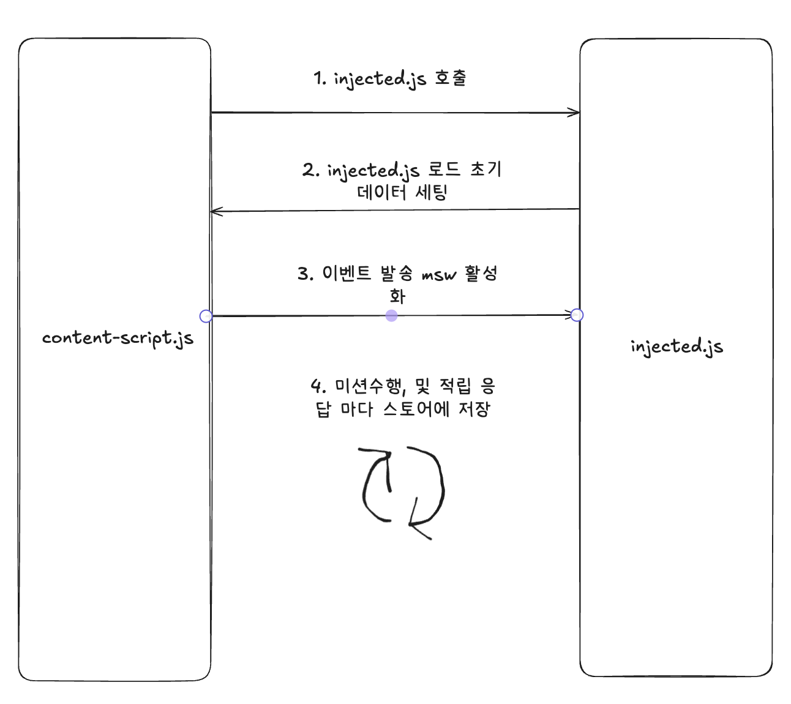

# 리워드 테스트 확장프로그램

## 개요

해당 확장프로그램은 리워드 서비스 특성 상 개인화 데이터 테스트의 어려움을 해결하고 비개발, 개발 직군에게 일관되게 테스트할 수 있도록 MSW(@mswjs/interceptors) 기반 Mocking 시스템을 제공합니다. qa, stage, prod 에서 서버 환경 없이 브라우저 환경에서 동일한 테스트를 재현하도록 보장합니다.
특히 브라우저 확장 프로그램 형태로 구성되어 있어, 실 서비스 페이지 위에서 API 응답을 가로채고(mock), 다양한 리워드 데이터 시나리오를 실시간으로 적용할 수 있습니다.

## 주의사항

1. @mswjs/interceptors는 데이터 호출 이전에 응답을 가로채므로 네트워크 탭에 잡히지 않습니다.
2. 포인트 조회 히스토리 api는 네트워크만 가로채고 상세 응답은 구현되지 않았습니다.
3. 원인미상의 이유로 해당 확장프로그램 팝업에서 테스트 활성화 시 데이터가 안나올 수 있습니다. 이럴 때 확장프로그램을 삭제하거나 비활성화, 활성화 토글을 여러번 시도하면 정상 동작합니다.
4. 악성유저가 어뷰징 목적이나 의도치 않은 요청에 대해(포인트 다중 적립, 미션과 퀘스트 불일치 등) 대부분 예외처리가 되어 있으나 모든 사항에 대해 처리되지 않았습니다. (미션 두개 초과 동시 실행 등)

## 기능

1. MSW Interceptor 기반 요청 리워드 서버와 동일한 응답 제공
2. 사용자가 설정한 mock 데이터는 chrome.storage를 통해 지속 저장
3. 페이지 리로드 후에도 동일한 테스트 상태 유지
4. Mock 활성화/비활성화 토글 제공
5. 실제 네트워크 요청과 동일한 흐름으로 동작하여 UI 변경 테스트에 최적화

## 설치 및 실행 방법

1. 해당 프로젝트를 빌드합니다.

```shell
pnpm build
```

2. chrome://extensions 을 접속합니다..

3. 우측 상단의 개발자 모드를 켭니다.

4. 빌드된 dist 폴더를 드래그앤 드랍 합니다.

5. 리워드 테스트 확장프로그램을 고정시키고 팝업에서 테스트 활성화를 클릭합니다.

## 구조

리워드를 테스트하면서 새 페이지로 랜딩시에도 수행한 미션 데이터가 휘발되지 않고 저장하기 위해 아래와 같은 구조로 양방향 이벤트를 사용하여 저장합니다.

[https://developer.chrome.com/docs/extensions/develop/concepts/content-scripts?hl=ko](https://developer.chrome.com/docs/extensions/develop/concepts/content-scripts?hl=ko)

### content-script.js

content-script.js는 확장 프로그램 환경과 웹 페이지 환경을 연결하는 중간 다리입니다.브라우저 환경에서 chrome.storage나 chrome.runtime에 직접 접근할 수 없기 때문에 content-script.js가 필요합니다.

### injected.js

content-script.js 에서 호출하는 스크립트로 브라우저 런타임환경과 동일합니다.
해당 파일에서 실제 응답 모킹이 이루어집니다.
크롬확장프로그램에서 제공하는 chrome.storage나 chrome.runtime이 사용 불가합니다.




**1 injected.js 호출**

```javascript
content-script.js

const script = document.createElement("script");
// 경로는 빌드파일에 manifest.json을 루트로 기준삼음
script.src = chrome.runtime.getURL("injected.js");
(document.head || document.documentElement).appendChild(script);
```

**2 injected.js 로드 초기 데이터 세팅**

```javascript
// content-script.js

script.onload = () => {
  chrome.storage.local.get<{ activated: boolean; rewardData: any }>(["activated", "rewardData"], (result) => {
    if (result.activated) { 
      if (result.rewardData) {
        console.log('초기 리워드 데이터', result.rewardData);
        window.postMessage({ type: MSW_LOAD_REWARD_DATA, payload: result.rewardData }, "*");
      }
      window.dispatchEvent(new CustomEvent(MSW_ACTIVATE));
    }
  });
};
```

**3 저장된 데이터 세팅하기 위해 이벤트 발송 msw 활성화**

```javascript
// injected.js

window.addEventListener("message", (event) => {
  if (event.data?.type === MSW_LOAD_REWARD_DATA) {
    rewardFakeService.setSavedData(event.data.payload);
  }
});

window.addEventListener(MSW_ACTIVATE, () => {
  interceptor.apply();
})
```

**4 응답할 때 마다 데이터 저장**

```javascript
// injected.js

window.postMessage({
    type: SAVE_DATA,
    payload: JSON.stringify(rewardFakeService.getSavedData()),
  });

  return new Response(JSON.stringify(data), {
    ...responseInit,
    headers: {
      "Content-Type": "application/json",
    },
  });


// content-script.js
/** @description 모킹 응답시 데이터 실시간 저장 */
window.addEventListener("message", (event) => {
  if (event.data?.type === SAVE_DATA) {
    const data = JSON.parse(event.data.payload);
    console.log('저장될 리워드 데이터', data);

    if (!isEmpty(data)) {
      chrome.storage.local.set({ rewardData: data });
    }
  }
});

```